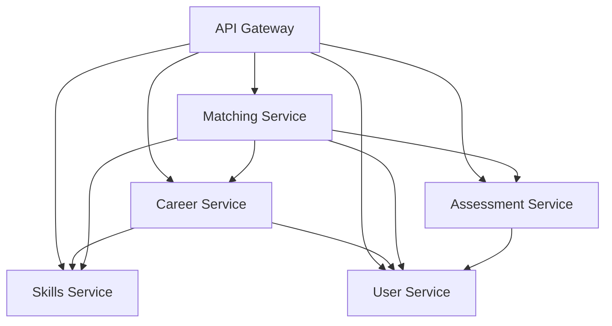

# Router to Microservice Mapping

## Current State Analysis

### Total Routers: 37+

## Proposed Microservice Architecture

### 1. Career Service
**Responsibility**: Career recommendations, paths, progression

**Routers to migrate**:
- careers.py - Career listing and details
- career_goals.py - User career goals management
- career_progression.py - Career path progression
- llm_career_advisor.py - AI-powered career advice
- job_recommendations.py - Job matching
- recommendations.py - General recommendations
- jobs.py - Job listings and details
- job_chat.py - Job-related chat

**Core Entities**:
- Career
- CareerPath
- CareerRecommendation
- Job
- CareerGoal

### 2. Skills Service
**Responsibility**: Skills matching, requirements, competency trees

**Routers to migrate**:
- competence_tree.py - Competency tree visualization
- tree.py - Skills tree structure
- tree_paths.py - Learning paths
- node_notes.py - Skill node annotations
- vector_search.py - Skill vector search

**Core Entities**:
- Skill
- SkillRequirement
- CompetencyTree
- SkillPath
- SkillVector

### 3. Assessment Service  
**Responsibility**: Personality tests, skill assessments

**Routers to migrate**:
- holland_test.py - Holland personality test
- hexaco_test.py - HEXACO personality test
- test.py - General testing endpoints
- insight_router.py - Assessment insights
- reflection_router.py - Self-reflection tools

**Core Entities**:
- Assessment
- TestResult
- PersonalityProfile
- Insight
- Reflection

### 4. User Service
**Responsibility**: User profiles, authentication, preferences

**Routers to migrate**:
- user.py - User authentication
- users.py - User management
- profiles.py - User profiles
- avatar.py - User avatars
- onboarding.py - User onboarding
- user_progress.py - Progress tracking
- peers.py - Peer connections
- space.py - User workspace

**Core Entities**:
- User
- UserProfile
- UserPreferences
- UserProgress
- PeerConnection

### 5. Matching Service
**Responsibility**: AI-powered matching for education, careers, peers

**Routers to migrate**:
- program_recommendations.py - Education program matching
- education.py - Education paths
- school_programs.py - School programs
- courses.py - Course recommendations
- enhanced_chat.py - AI chat interactions
- socratic_chat.py - Socratic method chat
- chat.py - General chat
- conversations.py - Conversation management
- messages.py - Message handling
- share.py - Content sharing
- chat_analytics.py - Chat analytics

**Core Entities**:
- Match
- EducationProgram
- Course
- Conversation
- ChatMessage

## Service Dependencies

## Database Separation Strategy

### Career Service DB
- careers
- career_paths
- career_recommendations
- jobs
- career_goals

### Skills Service DB
- skills
- skill_requirements
- competency_trees
- skill_vectors

### Assessment Service DB
- assessments
- test_results
- personality_profiles
- insights

### User Service DB
- users
- user_profiles
- user_preferences
- user_progress

### Matching Service DB
- matches
- education_programs
- courses
- conversations
- chat_messages
