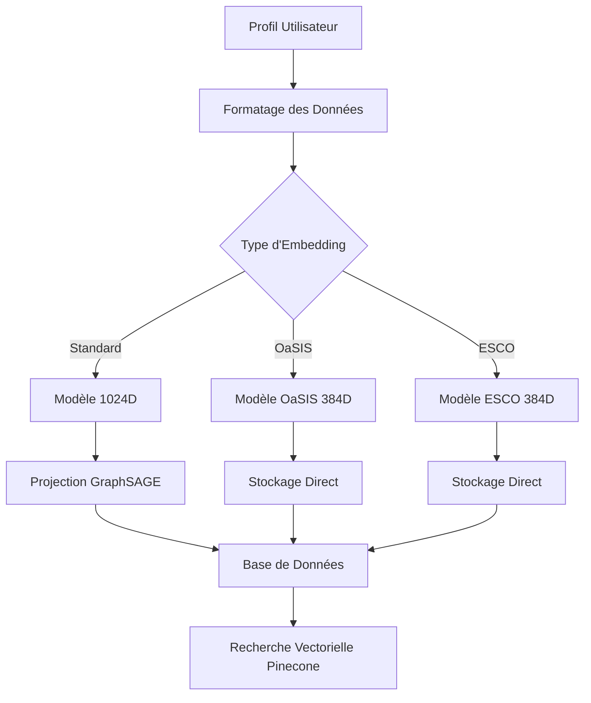
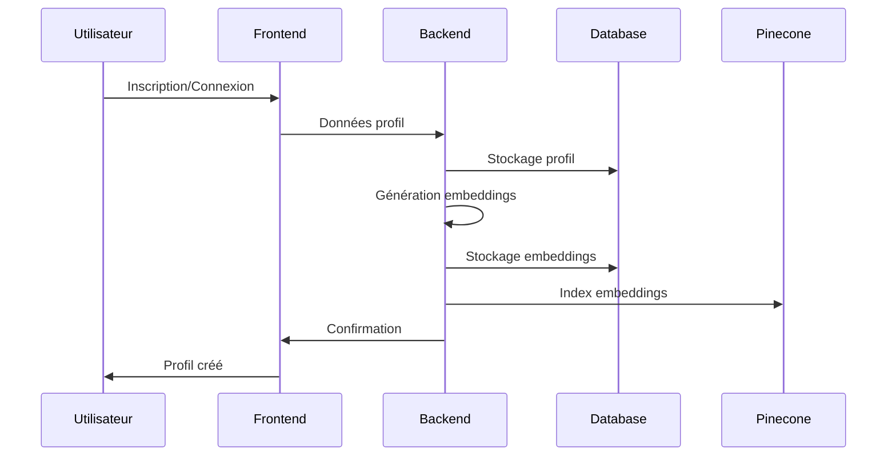
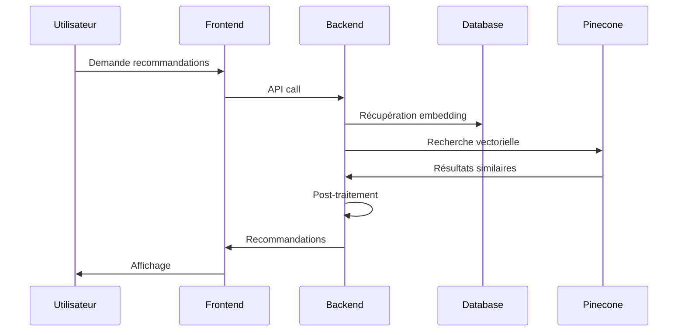

# Analyse Complète de la Plateforme Navigo

## Vue d'ensemble

Navigo est une plateforme sophistiquée d'orientation de carrière basée sur l'intelligence artificielle qui utilise des représentations vectorielles pour comprendre et analyser les profils utilisateurs. La plateforme se concentre sur l'analyse longitudinale des utilisateurs, leurs aspirations, leur profil psychologique et leurs progressions dans le temps.

## Architecture Technique

### Stack Technologique

#### Frontend
- **Framework**: Next.js 13.4.10 (React avec App Router)
- **Styling**: TailwindCSS 4.1.3 avec Autoprefixer
- **Animations**: Framer Motion 12.7.3
- **Visualisations**: Lottie React 2.4.1
- **HTTP Client**: Axios 1.8.4
- **Déploiement**: Vercel

#### Backend
- **Framework**: FastAPI 0.103.1 (Python)
- **Base de données**: PostgreSQL 15 avec extension pgvector
- **ORM**: SQLAlchemy 2.0.20 avec Alembic 1.12.0
- **Serveur**: Uvicorn 0.23.2
- **Embeddings**: Sentence Transformers 2.2.2
- **Déploiement**: Railway

#### Infrastructure
- **Conteneurisation**: Docker avec Docker Compose
- **Base de données vectorielle**: Pinecone (pour la recherche de similarité)
- **Stockage**: MinIO (S3-compatible)
- **Monitoring**: Logging rotatif avec configuration personnalisée

### Architecture des Données

#### Modèles de Données Principaux

1. **User** (`users`)
   - Authentification de base (email, mot de passe hashé)
   - Relations vers tous les autres modèles

2. **UserProfile** (`user_profiles`)
   - Données démographiques et personnelles
   - Informations de carrière (job_title, industry, years_experience)
   - Champs d'embeddings multiples:
     - `embedding`: Embedding standard (1024D)
     - `oasis_embedding`: Embedding OaSIS (384D)
     - `esco_embedding`: Embedding ESCO complet (384D)
     - `esco_embedding_occupation`: Embedding ESCO occupation (384D)
     - `esco_embedding_skill`: Embedding ESCO compétences (384D)
     - `esco_embedding_skillsgroup`: Embedding ESCO groupes de compétences (384D)

3. **SavedRecommendation** (`saved_recommendations`)
   - Recommandations sauvegardées par l'utilisateur
   - Métadonnées et traits cognitifs

4. **UserSkill** et **UserSkillTree**
   - Gestion des compétences et arbres de compétences
   - Progression et niveaux

5. **TreePath** et **NodeNote**
   - Navigation dans les arbres de carrière
   - Annotations utilisateur

## Système d'Embeddings Vectoriels

### Types d'Embeddings

La plateforme utilise plusieurs types d'embeddings pour capturer différents aspects du profil utilisateur:

#### 1. Embedding Standard (1024D)
- **Modèle**: `sentence-transformers/all-mpnet-base-v2` avec projection personnalisée
- **Usage**: Représentation générale du profil utilisateur
- **Stockage**: Colonne `embedding` dans `user_profiles`

#### 2. Embeddings OaSIS (384D)
- **Modèle**: `sentence-transformers/all-MiniLM-L6-v2`
- **Usage**: Profil psychologique basé sur le modèle OaSIS
- **Stockage**: Colonne `oasis_embedding` dans `user_profiles`

#### 3. Embeddings ESCO (384D)
- **Modèle**: `sentence-transformers/all-MiniLM-L6-v2`
- **Types**:
  - **Occupation**: Focus sur les métiers (`esco_embedding_occupation`)
  - **Skill**: Focus sur les compétences (`esco_embedding_skill`)
  - **SkillGroup**: Focus sur les groupes de compétences (`esco_embedding_skillsgroup`)
  - **Full**: Profil ESCO complet (`esco_embedding`)

### Pipeline de Génération d'Embeddings



## Fonctionnalités Principales

### 1. Système de Recommandations de Carrière

#### Architecture du Service
- **Service**: `Swipe_career_recommendation_service.py`
- **Méthode**: Recherche vectorielle via Pinecone
- **Algorithme**: Similarité cosinus avec diversification

#### Flux de Recommandation
1. Récupération de l'embedding utilisateur (OaSIS ou standard)
2. Requête Pinecone avec l'embedding
3. Post-traitement pour la diversification
4. Filtrage et classement des résultats

### 2. Recommandations d'Emploi ESCO

#### Architecture du Service
- **Service**: `occupationTree.py`
- **Index Pinecone**: `esco-368`
- **Types d'embeddings supportés**: Tous les types ESCO

#### Fonctionnalités
- Recommandations basées sur différents types d'embeddings ESCO
- API REST avec paramètres configurables
- Stockage des recommandations pour optimisation

### 3. Arbres de Compétences Interactifs

#### Architecture du Service
- **Service**: `competenceTree.py`
- **Fonctionnalités**:
  - Extraction des compétences dominantes
  - Construction d'arbres hiérarchiques
  - Navigation interactive
  - Intégration avec modèles GNN (GraphSAGE)

### 4. Test de Personnalité Holland (RIASEC)

#### Dimensions Mesurées
- **R**: Réaliste
- **I**: Investigateur  
- **A**: Artistique
- **S**: Social
- **E**: Entreprenant
- **C**: Conventionnel

#### Intégration
- Stockage des résultats dans la base de données
- Utilisation pour la génération d'embeddings
- Affichage dans l'interface utilisateur

### 5. Système de Matching de Pairs

#### Architecture
- **Service**: `peer_matching_service.py`
- **Algorithme**: Similarité cosinus entre embeddings
- **Fonctionnalités**:
  - Génération d'embeddings à la volée
  - Calcul de similarité
  - Suggestions de pairs similaires

## Routage et Navigation

### Frontend (Next.js App Router)

#### Structure des Routes
```
/                          # Page d'accueil (dashboard)
/chat                      # Interface de chat
/chat/[peerId]            # Chat avec un pair spécifique
/find-your-way            # Recommandations de carrière (swipe)
/saved                    # Espace personnel (recommandations sauvées)
/profile                  # Profil utilisateur
/profile/holland-results  # Résultats du test Holland
/competence-tree          # Arbre de compétences
/career                   # Arbre de carrière
/tree                     # Arbres sauvegardés
/vector-search            # Recherche vectorielle
/register                 # Inscription
/case-study-journey       # Études de cas
```

#### Composants de Navigation
- **MainLayout**: Layout principal avec navigation
- **NewSidebar**: Barre latérale avec navigation principale
- **Navigation contextuelle**: Selon la page active

### Backend (FastAPI)

#### Structure des Routers
```python
# Authentification et utilisateurs
/auth/*                   # Authentification
/users/*                  # Gestion des utilisateurs
/profiles/*               # Profils utilisateurs

# Fonctionnalités principales
/careers/*                # Recommandations de carrière
/api/v1/jobs/*           # Recommandations d'emploi ESCO
/competence-tree/*        # Arbres de compétences
/tree/*                   # Gestion des arbres
/vector-search/*          # Recherche vectorielle

# Communication
/chat/*                   # Chat
/peers/*                  # Gestion des pairs
/messages/*               # Messages

# Données et progression
/space/*                  # Espace personnel
/holland-test/*           # Test de personnalité
/recommendations/*        # Recommandations générales
/insights/*               # Analyses et insights
```

## Flux de Données Principal

### 1. Onboarding Utilisateur


### 2. Génération de Recommandations


## Aspects Longitudinaux et Évolutifs

### Suivi de Progression
1. **UserProgress**: Suivi des progressions dans les arbres
2. **TreePath**: Historique des chemins explorés
3. **NodeNote**: Annotations et réflexions utilisateur
4. **SavedRecommendation**: Évolution des intérêts

### Mise à Jour des Embeddings
- Régénération périodique basée sur les nouvelles données
- Mise à jour incrémentale des profils
- Versioning des embeddings pour analyse temporelle

## Intégrations et Services Externes

### Pinecone
- **Index principal**: Recommandations de carrière
- **Index ESCO**: `esco-368` pour recommandations d'emploi
- **Métriques**: Similarité cosinus
- **Namespaces**: Séparation par type de données

### Modèles ML/AI
1. **Sentence Transformers**: Génération d'embeddings
2. **GraphSAGE**: Projection et analyse de graphes
3. **Modèles personnalisés**: Fine-tuning pour domaines spécifiques

## Sécurité et Performance

### Authentification
- JWT tokens avec refresh
- Middleware CORS configuré
- Headers de sécurité

### Optimisations
- Mise en cache des embeddings
- Pagination des résultats
- Lazy loading des composants
- Optimisation des requêtes vectorielles

## Monitoring et Logging

### Backend
- Logging rotatif avec niveaux configurables
- Monitoring des performances des modèles
- Tracking des erreurs et exceptions

### Frontend
- Analytics Vercel
- Speed Insights
- Error boundaries React

## Déploiement et DevOps

### Environnements
- **Développement**: Local avec Docker Compose
- **Production**: Railway (backend) + Vercel (frontend)

### CI/CD
- Déploiement automatique via Git
- Variables d'environnement sécurisées
- Health checks et monitoring

## Recommandations pour le Développement de Nouvelles Fonctionnalités

### 1. Analyse des Embeddings
Lors du développement de nouvelles fonctionnalités, considérer:
- Quel type d'embedding utiliser (standard, OaSIS, ESCO)
- Impact sur la performance des requêtes vectorielles
- Nécessité de nouveaux types d'embeddings

### 2. Intégration avec l'Existant
- Utiliser les services existants (`Oasisembedding_service`, `occupationTree`)
- Respecter les patterns d'API établis
- Maintenir la cohérence des données vectorielles

### 3. Aspects Longitudinaux
- Prévoir le stockage de l'historique
- Implémenter le versioning des données
- Considérer l'évolution temporelle des profils

### 4. Performance et Scalabilité
- Optimiser les requêtes vectorielles
- Implémenter la mise en cache appropriée
- Prévoir la pagination pour les grandes datasets

Cette analyse fournit une base solide pour comprendre l'architecture complexe de Navigo et guide le développement de nouvelles fonctionnalités en harmonie avec l'écosystème vectoriel existant.