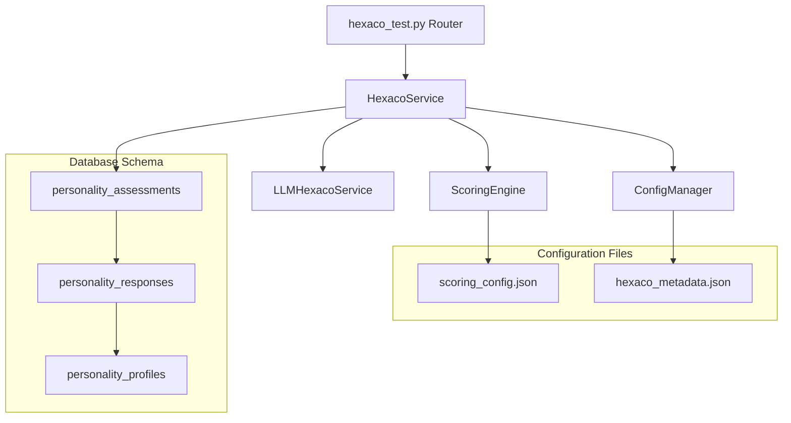
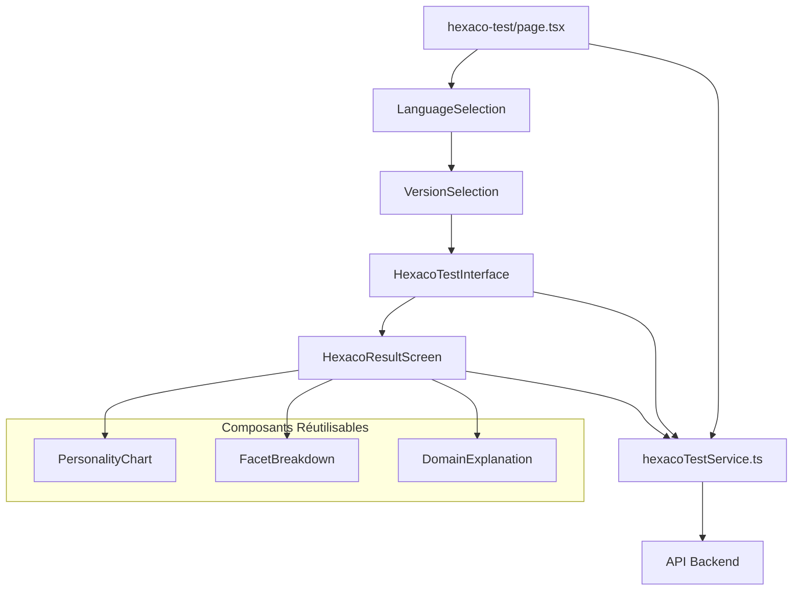
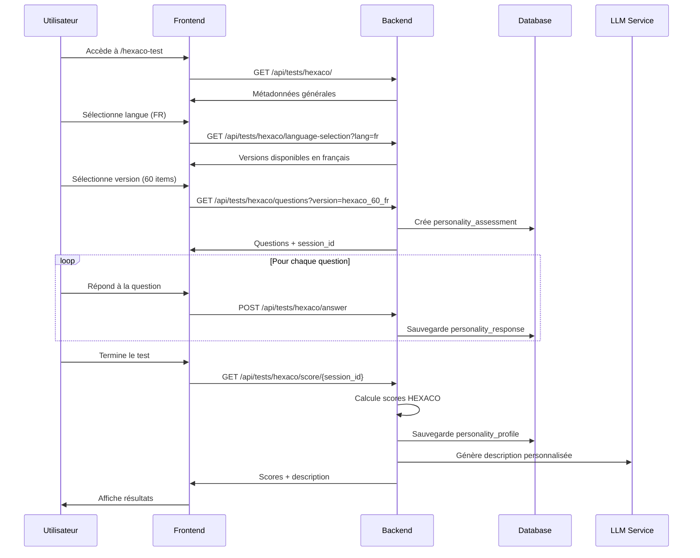

# Plan d'Architecture HEXACO-PI-R pour Orientor

## 🔍 Analyse de l'Architecture Existante

### Schéma de Base de Données
Le schéma [`personality_*`](SQL_Schema/personalityTables.sql:1) est **parfaitement compatible** avec HEXACO :
- [`personality_assessments`](SQL_Schema/personalityTables.sql:2) : Gestion des sessions avec support multi-versions
- [`personality_responses`](SQL_Schema/personalityTables.sql:20) : Stockage des réponses individuelles
- [`personality_profiles`](SQL_Schema/personalityTables.sql:34) : Profils calculés avec scores JSONB
- Support natif pour `assessment_type = 'hexaco'` et versions multiples

### Architecture Holland Existante
**Backend** : [`holland_test.py`](../backend/app/routers/holland_test.py:1) avec pattern robuste :
- Routes RESTful bien structurées
- Gestion d'erreurs complète
- Service LLM intégré pour descriptions

**Frontend** : [`holland-test/page.tsx`](../frontend/src/app/holland-test/page.tsx:1) avec flux utilisateur optimal :
- États de test bien gérés (`loading` → `intro` → `testing` → `results`)
- Service dédié [`hollandTestService.ts`](../frontend/src/services/hollandTestService.ts:1)
- Composants réutilisables

## 🏗️ Architecture HEXACO Proposée

### Structure Backend



#### 1. Routes Backend (`/backend/app/routers/hexaco_test.py`)

```python
# Routes principales
GET /api/tests/hexaco/                    # Métadonnées du test
GET /api/tests/hexaco/language-selection  # Sélection langue
GET /api/tests/hexaco/version-selection   # Sélection version (60/100)
GET /api/tests/hexaco/questions          # Questions par version
POST /api/tests/hexaco/answer            # Sauvegarde réponse
GET /api/tests/hexaco/score/{session_id} # Calcul scores
GET /api/tests/hexaco/profile/{user_id}  # Profil utilisateur
```

#### 2. Services Backend

**`/backend/app/services/hexaco_service.py`**
- Gestion des sessions d'évaluation
- Orchestration du workflow de test
- Interface avec le schéma [`personality_*`](SQL_Schema/personalityTables.sql:1)

**`/backend/app/services/hexaco_scoring_service.py`**
- Calcul des scores des 24 facettes
- Agrégation vers les 6 domaines HEXACO
- Gestion des [`reverse_keyed`](../data_n_notebook/data/English_60_FULL.csv:2) items

**`/backend/app/services/LLMhexaco_service.py`**
- Génération de descriptions personnalisées
- Analyse des profils HEXACO
- Recommandations basées sur les traits

#### 3. Configuration JSON

**`/backend/config/hexaco_scoring_config.json`**
```json
{
  "domains": {
    "Honesty-Humility": {
      "facets": ["Sincerity", "Fairness", "Greed-Avoidance", "Modesty"],
      "description": "Tendance à être sincère, équitable, modeste et non matérialiste"
    },
    "Emotionality": {
      "facets": ["Fearfulness", "Anxiety", "Dependence", "Sentimentality"],
      "description": "Tendance à ressentir la peur, l'anxiété, la dépendance et la sentimentalité"
    },
    "Extraversion": {
      "facets": ["Social Self-Esteem", "Social Boldness", "Sociability", "Liveliness"],
      "description": "Tendance à être sociable, énergique, extraverti et assertif"
    },
    "Agreeableness": {
      "facets": ["Forgiveness", "Gentleness", "Flexibility", "Patience"],
      "description": "Tendance à être indulgent, tolérant, flexible et patient"
    },
    "Conscientiousness": {
      "facets": ["Organization", "Diligence", "Perfectionism", "Prudence"],
      "description": "Tendance à être organisé, travailleur, perfectionniste et prudent"
    },
    "Openness": {
      "facets": ["Aesthetic Appreciation", "Inquisitiveness", "Creativity", "Unconventionality"],
      "description": "Tendance à apprécier l'art, être curieux, créatif et non-conventionnel"
    }
  },
  "facet_mappings": {
    "Sincerity": {"items": [6, 30, 54], "reverse_items": []},
    "Fairness": {"items": [36, 60], "reverse_items": [12]},
    "Greed-Avoidance": {"items": [18, 42], "reverse_items": []},
    "Modesty": {"items": [48], "reverse_items": [24]},
    "Fearfulness": {"items": [5, 29, 53], "reverse_items": []},
    "Anxiety": {"items": [11, 35, 59], "reverse_items": []},
    "Dependence": {"items": [17, 41], "reverse_items": []},
    "Sentimentality": {"items": [23, 47], "reverse_items": []},
    "Social Self-Esteem": {"items": [4, 28, 52], "reverse_items": []},
    "Social Boldness": {"items": [34, 58], "reverse_items": [10]},
    "Sociability": {"items": [16, 40], "reverse_items": []},
    "Liveliness": {"items": [22, 46], "reverse_items": []},
    "Forgiveness": {"items": [3, 27, 51], "reverse_items": []},
    "Gentleness": {"items": [33, 57], "reverse_items": [9]},
    "Flexibility": {"items": [39], "reverse_items": [15]},
    "Patience": {"items": [45], "reverse_items": [21]},
    "Organization": {"items": [2, 26, 50], "reverse_items": []},
    "Diligence": {"items": [8, 32, 56], "reverse_items": []},
    "Perfectionism": {"items": [38], "reverse_items": [14]},
    "Prudence": {"items": [44], "reverse_items": [20]},
    "Aesthetic Appreciation": {"items": [25, 49], "reverse_items": [1]},
    "Inquisitiveness": {"items": [7, 31, 55], "reverse_items": []},
    "Creativity": {"items": [13, 37], "reverse_items": []},
    "Unconventionality": {"items": [43], "reverse_items": [19]}
  },
  "reverse_keyed_items": [1, 9, 10, 12, 14, 15, 19, 20, 21, 24]
}
```

**`/backend/config/hexaco_metadata.json`**
```json
{
  "versions": {
    "hexaco_60_fr": {
      "title": "Test HEXACO-PI-R (Version courte - Français)",
      "description": "Évaluation complète de personnalité en 60 questions",
      "item_count": 60,
      "estimated_duration": 15,
      "csv_file": "French_60_FULL.csv",
      "language": "fr",
      "active": true
    },
    "hexaco_100_fr": {
      "title": "Test HEXACO-PI-R (Version complète - Français)",
      "description": "Évaluation approfondie de personnalité en 100 questions",
      "item_count": 100,
      "estimated_duration": 25,
      "csv_file": "French_100_FULL.csv",
      "language": "fr",
      "active": true
    },
    "hexaco_60_en": {
      "title": "HEXACO-PI-R Test (Short Version - English)",
      "description": "Comprehensive personality assessment in 60 questions",
      "item_count": 60,
      "estimated_duration": 15,
      "csv_file": "English_60_FULL.csv",
      "language": "en",
      "active": true
    },
    "hexaco_100_en": {
      "title": "HEXACO-PI-R Test (Full Version - English)",
      "description": "In-depth personality assessment in 100 questions",
      "item_count": 100,
      "estimated_duration": 25,
      "csv_file": "English_100_FULL.csv",
      "language": "en",
      "active": true
    }
  },
  "languages": {
    "fr": {
      "name": "Français",
      "flag": "🇫🇷",
      "description": "Version française du test HEXACO-PI-R"
    },
    "en": {
      "name": "English",
      "flag": "🇺🇸",
      "description": "English version of HEXACO-PI-R test"
    }
  }
}
```

### Structure Frontend



#### 1. Pages Frontend

**`/frontend/src/app/hexaco-test/page.tsx`**
- Page principale avec sélection séquentielle
- États : `language-selection` → `version-selection` → `testing` → `results`

**`/frontend/src/app/hexaco-test/language-selection/page.tsx`**
- Sélection français/anglais
- Interface intuitive avec drapeaux/icônes

**`/frontend/src/app/hexaco-test/version-selection/page.tsx`**
- Choix entre version 60 ou 100 items
- Comparaison durée/précision

#### 2. Composants Spécialisés

**`/frontend/src/components/hexaco-test/HexacoTestInterface.tsx`**
- Interface de test adaptée aux questions HEXACO
- Échelle Likert 1-5 avec labels appropriés
- Gestion des [`reverse_keyed`](../data_n_notebook/data/English_60_FULL.csv:2) (transparente pour l'utilisateur)

**`/frontend/src/components/hexaco-test/HexacoResultScreen.tsx`**
- Visualisation des 6 domaines HEXACO
- Graphique radar interactif
- Détail des 24 facettes

**`/frontend/src/components/hexaco-test/PersonalityChart.tsx`**
- Graphique radar des domaines
- Comparaison avec moyennes normatives
- Animations et interactivité

#### 3. Service Frontend

**`/frontend/src/services/hexacoTestService.ts`**
```typescript
interface HexacoVersion {
  id: string;
  language: 'fr' | 'en';
  itemCount: 60 | 100;
  title: string;
  description: string;
  estimatedDuration: number;
}

interface HexacoScores {
  domains: {
    'Honesty-Humility': number;
    'Emotionality': number;
    'Extraversion': number;
    'Agreeableness': number;
    'Conscientiousness': number;
    'Openness': number;
  };
  facets: {
    // Honesty-Humility facets
    'Sincerity': number;
    'Fairness': number;
    'Greed-Avoidance': number;
    'Modesty': number;
    // Emotionality facets
    'Fearfulness': number;
    'Anxiety': number;
    'Dependence': number;
    'Sentimentality': number;
    // Extraversion facets
    'Social Self-Esteem': number;
    'Social Boldness': number;
    'Sociability': number;
    'Liveliness': number;
    // Agreeableness facets
    'Forgiveness': number;
    'Gentleness': number;
    'Flexibility': number;
    'Patience': number;
    // Conscientiousness facets
    'Organization': number;
    'Diligence': number;
    'Perfectionism': number;
    'Prudence': number;
    // Openness facets
    'Aesthetic Appreciation': number;
    'Inquisitiveness': number;
    'Creativity': number;
    'Unconventionality': number;
  };
  percentiles: Record<string, number>;
  reliability: Record<string, number>;
  narrative_description?: string;
}

interface HexacoQuestion {
  item_id: number;
  item_text: string;
  response_min: number;
  response_max: number;
  version: string;
  language: string;
  reverse_keyed: boolean;
  facet: string;
}
```

## 🔄 Workflow Complet du Test HEXACO



## 📁 Structure des Fichiers à Créer

### Backend
```
backend/app/
├── routers/
│   └── hexaco_test.py                 # Routes principales HEXACO
├── services/
│   ├── hexaco_service.py              # Service principal HEXACO
│   ├── hexaco_scoring_service.py      # Logique de scoring
│   └── LLMhexaco_service.py          # Descriptions LLM
├── schemas/
│   └── hexaco.py                      # Modèles Pydantic HEXACO
└── config/
    ├── hexaco_scoring_config.json     # Configuration scoring
    └── hexaco_metadata.json           # Métadonnées versions
```

### Frontend
```
frontend/src/
├── app/hexaco-test/
│   ├── page.tsx                       # Page principale
│   ├── language-selection/
│   │   └── page.tsx                   # Sélection langue
│   └── version-selection/
│       └── page.tsx                   # Sélection version
├── components/hexaco-test/
│   ├── HexacoTestInterface.tsx        # Interface de test
│   ├── HexacoResultScreen.tsx         # Écran résultats
│   ├── PersonalityChart.tsx           # Graphique radar
│   ├── FacetBreakdown.tsx            # Détail facettes
│   ├── DomainExplanation.tsx          # Explications domaines
│   └── LanguageSelector.tsx           # Sélecteur de langue
└── services/
    └── hexacoTestService.ts           # Service API HEXACO
```

## 🔗 Points d'Intégration

### 1. Réutilisation des Composants Holland
- **Loader et états de test** : Réutiliser la logique de [`page.tsx`](../frontend/src/app/holland-test/page.tsx:83)
- **Gestion d'erreurs** : Adapter le pattern de [`hollandTestService.ts`](../frontend/src/services/hollandTestService.ts:65)
- **Interface utilisateur** : S'inspirer du design de [`Testinterface`](../frontend/src/app/holland-test/page.tsx:175)

### 2. Intégration Base de Données
- **Compatibilité** : Utiliser le schéma [`personality_*`](SQL_Schema/personalityTables.sql:1) existant
- **Migration future** : Préparer la migration Holland vers le nouveau schéma
- **Embeddings** : Intégrer avec [`personality_embeddings`](SQL_Schema/personalityTables.sql:53)

### 3. Services LLM
- **Pattern existant** : Suivre [`LLMholland_service.py`](../backend/app/routers/holland_test.py:8)
- **Descriptions personnalisées** : Adapter pour les traits HEXACO
- **Recommandations** : Intégrer avec le système de recommandations existant

## 🎯 Mapping Facettes → Domaines HEXACO

### Configuration de Scoring Détaillée

#### Logique de Scoring avec Reverse_Keyed
```python
def calculate_facet_score(responses: List[int], items: List[int], reverse_items: List[int]) -> float:
    """
    Calcule le score d'une facette HEXACO
    
    Args:
        responses: Liste des réponses (1-5)
        items: Liste des IDs d'items pour cette facette
        reverse_items: Liste des IDs d'items à inverser
    
    Returns:
        Score moyen de la facette (1.0-5.0)
    """
    total = 0
    count = 0
    
    for item_id in items:
        if item_id in responses:
            response = responses[item_id]
            
            # Inversion pour les items reverse_keyed
            if item_id in reverse_items:
                response = 6 - response  # Inversion pour échelle 1-5
            
            total += response
            count += 1
    
    return total / count if count > 0 else 0.0

def calculate_domain_score(facet_scores: Dict[str, float], domain_facets: List[str]) -> float:
    """
    Calcule le score d'un domaine HEXACO à partir des scores de facettes
    
    Args:
        facet_scores: Dictionnaire des scores de facettes
        domain_facets: Liste des facettes composant le domaine
    
    Returns:
        Score moyen du domaine (1.0-5.0)
    """
    total = sum(facet_scores.get(facet, 0.0) for facet in domain_facets)
    return total / len(domain_facets)
```

#### Formules de Calcul par Domaine

**Honesty-Humility** = moyenne(Sincerity, Fairness, Greed-Avoidance, Modesty)
**Emotionality** = moyenne(Fearfulness, Anxiety, Dependence, Sentimentality)
**Extraversion** = moyenne(Social Self-Esteem, Social Boldness, Sociability, Liveliness)
**Agreeableness** = moyenne(Forgiveness, Gentleness, Flexibility, Patience)
**Conscientiousness** = moyenne(Organization, Diligence, Perfectionism, Prudence)
**Openness** = moyenne(Aesthetic Appreciation, Inquisitiveness, Creativity, Unconventionality)

## 📊 Avantages de cette Architecture

### 1. Réutilisation Maximale
- **Patterns éprouvés** : S'appuie sur l'architecture Holland fonctionnelle
- **Composants existants** : Réutilise les interfaces et services
- **Cohérence UX** : Maintient l'expérience utilisateur familière

### 2. Flexibilité et Configuration
- **Configuration JSON** : Modifications sans redéploiement
- **Multi-versions** : Support natif des 4 versions HEXACO
- **Extensibilité** : Facilite l'ajout de nouveaux tests

### 3. Performance et Évolutivité
- **Schéma optimisé** : Base de données prête pour la charge
- **Calculs efficaces** : Algorithmes de scoring optimisés
- **Mise en cache** : Profils calculés stockés pour réutilisation

### 4. Maintenabilité
- **Séparation des responsabilités** : Services spécialisés
- **Documentation complète** : Architecture bien documentée
- **Tests unitaires** : Facilite les tests automatisés

### 5. Intégration Future
- **Migration Holland** : Prépare la convergence des systèmes
- **Nouveaux tests** : Architecture extensible pour d'autres évaluations
- **Analytics** : Données structurées pour analyses avancées

## 🚀 Plan de Mise en Œuvre

### Phase 1 : Backend Foundation (Semaine 1-2)
1. Créer les routes HEXACO de base
2. Implémenter le service de scoring
3. Configurer les fichiers JSON
4. Tests unitaires des calculs

### Phase 2 : Frontend Core (Semaine 3-4)
1. Développer les pages de sélection
2. Créer l'interface de test
3. Implémenter le service API
4. Tests d'intégration

### Phase 3 : Visualisation et UX (Semaine 5-6)
1. Développer les composants de résultats
2. Créer les graphiques interactifs
3. Intégrer les descriptions LLM
4. Tests utilisateur

### Phase 4 : Intégration et Optimisation (Semaine 7-8)
1. Intégrer avec le système existant
2. Optimiser les performances
3. Tests de charge
4. Documentation finale

Cette architecture garantit une intégration harmonieuse de HEXACO-PI-R tout en préservant l'existant et en préparant l'évolution future du système Orientor.