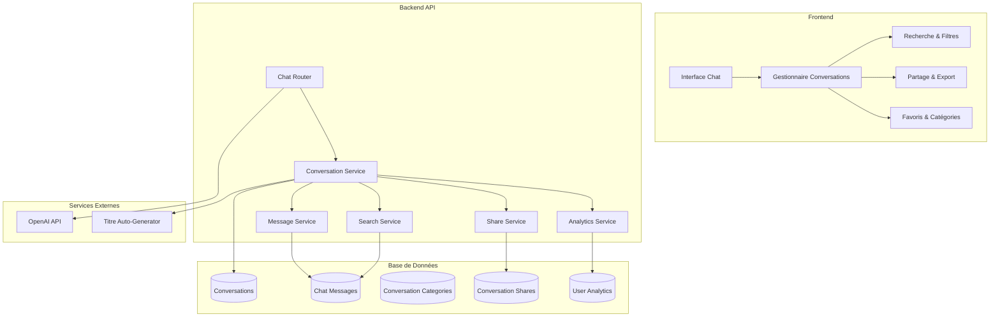

# PR Description : Système Complet de Persistance des Conversations LLM

## 🎯 Objectif

Implémenter un système complet de persistance et de gestion des conversations avec le LLM pour remplacer le stockage en mémoire actuel qui se perd à chaque redémarrage du serveur.

## 📋 Problème Actuel

Le système de chat existant (`/backend/app/routers/chat.py`) utilise un stockage en mémoire :
```python
conversation_history: Dict[int, List[Dict[str, str]]] = {}
```

**Limitations identifiées :**
- ❌ Perte de l'historique à chaque redémarrage du serveur
- ❌ Pas de persistance des conversations
- ❌ Impossible de récupérer les conversations précédentes
- ❌ Aucune fonctionnalité de gestion des conversations
- ❌ Pas de recherche dans l'historique
- ❌ Aucune analytics ou statistiques d'usage

## 🚀 Solution Proposée

Développement d'un système complet de persistance avec toutes les fonctionnalités avancées :

### Fonctionnalités Principales
- ✅ **Persistance complète** : Sauvegarde de toutes les conversations en base de données
- ✅ **Gestion des conversations** : Création, modification, suppression, archivage
- ✅ **Titres automatiques** : Génération intelligente de titres pour les conversations
- ✅ **Système de catégories** : Organisation des conversations par catégories personnalisées
- ✅ **Favoris** : Marquage des conversations importantes
- ✅ **Recherche avancée** : Recherche full-text dans l'historique avec filtres
- ✅ **Partage de conversations** : Liens publics et protégés par mot de passe
- ✅ **Export multi-format** : PDF, JSON, TXT
- ✅ **Analytics complètes** : Statistiques d'usage et tendances
- ✅ **Performance optimisée** : Index, pagination, cache

## 🏗️ Architecture Technique

### Diagramme d'Architecture



### Modèles de Base de Données

#### 1. Table `conversations`
```sql
CREATE TABLE conversations (
    id SERIAL PRIMARY KEY,
    user_id INTEGER REFERENCES users(id) NOT NULL,
    title VARCHAR(255) NOT NULL,
    auto_generated_title BOOLEAN DEFAULT TRUE,
    category_id INTEGER REFERENCES conversation_categories(id),
    is_favorite BOOLEAN DEFAULT FALSE,
    is_archived BOOLEAN DEFAULT FALSE,
    created_at TIMESTAMP WITH TIME ZONE DEFAULT NOW(),
    updated_at TIMESTAMP WITH TIME ZONE DEFAULT NOW(),
    last_message_at TIMESTAMP WITH TIME ZONE,
    message_count INTEGER DEFAULT 0,
    total_tokens_used INTEGER DEFAULT 0
);

-- Index pour performance
CREATE INDEX idx_user_conversations ON conversations(user_id, created_at);
CREATE INDEX idx_user_favorites ON conversations(user_id, is_favorite);
CREATE INDEX idx_category ON conversations(category_id);
```

#### 2. Table `chat_messages`
```sql
CREATE TABLE chat_messages (
    id SERIAL PRIMARY KEY,
    conversation_id INTEGER REFERENCES conversations(id) ON DELETE CASCADE,
    role VARCHAR(20) NOT NULL CHECK (role IN ('user', 'assistant', 'system')),
    content TEXT NOT NULL,
    tokens_used INTEGER,
    model_used VARCHAR(50),
    response_time_ms INTEGER,
    created_at TIMESTAMP WITH TIME ZONE DEFAULT NOW(),
    metadata JSONB
);

-- Index pour performance et recherche
CREATE INDEX idx_conversation_messages ON chat_messages(conversation_id, created_at);
CREATE INDEX idx_content_search ON chat_messages USING gin(to_tsvector('french', content));
```

#### 3. Table `conversation_categories`
```sql
CREATE TABLE conversation_categories (
    id SERIAL PRIMARY KEY,
    user_id INTEGER REFERENCES users(id) NOT NULL,
    name VARCHAR(100) NOT NULL,
    color VARCHAR(7), -- Code couleur hex
    icon VARCHAR(50),
    created_at TIMESTAMP WITH TIME ZONE DEFAULT NOW(),
    UNIQUE(user_id, name)
);
```

#### 4. Table `conversation_shares`
```sql
CREATE TABLE conversation_shares (
    id SERIAL PRIMARY KEY,
    conversation_id INTEGER REFERENCES conversations(id) ON DELETE CASCADE,
    shared_by INTEGER REFERENCES users(id) NOT NULL,
    share_token VARCHAR(255) UNIQUE NOT NULL,
    is_public BOOLEAN DEFAULT FALSE,
    password_hash VARCHAR(255), -- Pour partages protégés
    expires_at TIMESTAMP WITH TIME ZONE,
    view_count INTEGER DEFAULT 0,
    created_at TIMESTAMP WITH TIME ZONE DEFAULT NOW()
);

CREATE INDEX idx_share_token ON conversation_shares(share_token);
CREATE INDEX idx_shared_by ON conversation_shares(shared_by);
```

#### 5. Table `user_chat_analytics`
```sql
CREATE TABLE user_chat_analytics (
    id SERIAL PRIMARY KEY,
    user_id INTEGER REFERENCES users(id) NOT NULL,
    date DATE NOT NULL,
    messages_sent INTEGER DEFAULT 0,
    conversations_started INTEGER DEFAULT 0,
    total_tokens_used INTEGER DEFAULT 0,
    avg_response_time_ms FLOAT,
    most_used_category_id INTEGER REFERENCES conversation_categories(id),
    created_at TIMESTAMP WITH TIME ZONE DEFAULT NOW(),
    UNIQUE(user_id, date)
);
```

## 🔧 Services Backend

### 1. ConversationService
```python
class ConversationService:
    async def create_conversation(user_id: int, initial_message: str) -> Conversation
    async def get_user_conversations(user_id: int, filters: ConversationFilters) -> List[Conversation]
    async def get_conversation_by_id(conversation_id: int, user_id: int) -> Conversation
    async def update_conversation_title(conversation_id: int, title: str) -> bool
    async def auto_generate_title(conversation_id: int) -> str
    async def archive_conversation(conversation_id: int) -> bool
    async def delete_conversation(conversation_id: int) -> bool
    async def toggle_favorite(conversation_id: int) -> bool
    async def set_category(conversation_id: int, category_id: int) -> bool
```

### 2. ChatMessageService
```python
class ChatMessageService:
    async def add_message(conversation_id: int, role: str, content: str, metadata: dict) -> ChatMessage
    async def get_conversation_messages(conversation_id: int, limit: int, offset: int) -> List[ChatMessage]
    async def search_messages(user_id: int, query: str, filters: SearchFilters) -> List[ChatMessage]
    async def get_message_statistics(conversation_id: int) -> MessageStats
    async def export_conversation(conversation_id: int, format: str) -> bytes
```

### 3. CategoryService
```python
class CategoryService:
    async def create_category(user_id: int, name: str, color: str, icon: str) -> Category
    async def get_user_categories(user_id: int) -> List[Category]
    async def update_category(category_id: int, updates: dict) -> bool
    async def delete_category(category_id: int) -> bool
    async def get_category_statistics(category_id: int) -> CategoryStats
```

### 4. ShareService
```python
class ShareService:
    async def create_share_link(conversation_id: int, options: ShareOptions) -> ShareLink
    async def get_shared_conversation(share_token: str, password: str = None) -> Conversation
    async def update_share_settings(share_id: int, options: ShareOptions) -> bool
    async def revoke_share(share_id: int) -> bool
    async def get_share_analytics(share_id: int) -> ShareAnalytics
```

### 5. AnalyticsService
```python
class AnalyticsService:
    async def record_message_sent(user_id: int, tokens_used: int, response_time: int)
    async def record_conversation_started(user_id: int, category_id: int)
    async def get_user_analytics(user_id: int, period: str) -> UserAnalytics
    async def get_usage_trends(user_id: int) -> UsageTrends
    async def get_popular_topics(user_id: int) -> List[Topic]
```

## 🛠️ Endpoints API

### Chat Endpoints (Nouveaux/Améliorés)
```python
# Endpoints existants améliorés
POST /chat/send                          # Amélioré avec persistance
POST /chat/clear                         # Amélioré pour archiver au lieu de supprimer

# Nouveaux endpoints pour la gestion des conversations
POST /chat/conversations                 # Créer une nouvelle conversation
GET /chat/conversations                  # Lister les conversations de l'utilisateur
GET /chat/conversations/{id}             # Récupérer une conversation spécifique
PUT /chat/conversations/{id}             # Modifier une conversation (titre, catégorie)
DELETE /chat/conversations/{id}          # Supprimer une conversation
POST /chat/conversations/{id}/favorite   # Basculer le statut favori
POST /chat/conversations/{id}/archive    # Archiver/désarchiver une conversation

# Recherche et analytics
GET /chat/search                         # Recherche dans les conversations
GET /chat/analytics/usage               # Statistiques d'usage
GET /chat/analytics/trends              # Tendances d'utilisation
GET /chat/export/{conversation_id}      # Export de conversation

# Gestion des catégories
POST /chat/categories                    # Créer une catégorie
GET /chat/categories                     # Lister les catégories
PUT /chat/categories/{id}                # Modifier une catégorie
DELETE /chat/categories/{id}             # Supprimer une catégorie

# Partage de conversations
POST /chat/conversations/{id}/share     # Créer un lien de partage
GET /chat/shared/{token}                # Accéder à une conversation partagée
PUT /chat/shares/{id}                   # Modifier les paramètres de partage
DELETE /chat/shares/{id}                # Révoquer un partage
```

## ✨ Fonctionnalités Détaillées

### 1. Génération Automatique de Titres
```python
async def auto_generate_title(conversation_messages: List[str]) -> str:
    """
    Utilise OpenAI pour générer un titre pertinent basé sur les premiers messages
    """
    prompt = f"""
    Génère un titre court et descriptif (max 50 caractères) pour cette conversation:
    
    Messages: {conversation_messages[:3]}
    
    Le titre doit être en français et capturer l'essence de la conversation.
    Exemples: "Conseils carrière tech", "Orientation études", "Développement personnel"
    """
```

### 2. Recherche Avancée
- **Recherche full-text** dans le contenu des messages avec PostgreSQL
- **Filtres multiples** : date, catégorie, favoris, archivées
- **Highlighting** des termes recherchés dans les résultats
- **Suggestions automatiques** basées sur l'historique
- **Recherche par mots-clés** avec opérateurs booléens

### 3. Système de Partage Sécurisé
- **Liens publics** avec token unique non-devinable
- **Protection par mot de passe** pour les conversations sensibles
- **Expiration automatique** des liens de partage
- **Analytics des partages** : vues, interactions, géolocalisation
- **Contrôle d'accès** granulaire par l'utilisateur

### 4. Analytics et Statistiques Complètes
- **Métriques d'usage** : messages/jour, conversations/semaine
- **Analyse des tendances** : sujets populaires, évolution temporelle
- **Performance** : temps de réponse moyen, utilisation des tokens
- **Catégorisation automatique** des sujets de conversation
- **Rapports exportables** en PDF/Excel

### 5. Export et Sauvegarde
- **Formats multiples** : PDF stylisé, JSON structuré, TXT simple
- **Export sélectif** : conversations spécifiques ou par période
- **Sauvegarde automatique** quotidienne/hebdomadaire
- **Import de conversations** depuis d'autres plateformes
- **Archivage intelligent** des anciennes conversations

## 🔄 Migration et Déploiement

### Script de Migration
```python
async def migrate_existing_conversations():
    """
    Migre les conversations existantes en mémoire vers la base de données
    """
    # 1. Sauvegarder les conversations actuelles en mémoire
    # 2. Créer les nouvelles tables avec Alembic
    # 3. Convertir et insérer les données existantes
    # 4. Valider l'intégrité des données migrées
    # 5. Basculer vers le nouveau système
```

### Tests Complets
- **Tests unitaires** pour chaque service (>95% couverture)
- **Tests d'intégration** API avec base de données de test
- **Tests de performance** avec 10k+ messages par conversation
- **Tests de sécurité** pour le partage et l'accès aux données
- **Tests de charge** pour usage concurrent

## 📊 Considérations de Performance

### Optimisations Base de Données
- **Index composites** pour les requêtes fréquentes
- **Partitioning** des messages par date pour les gros volumes
- **Archivage automatique** des conversations anciennes
- **Compression** des messages texte volumineux

### Cache et Mémoire
- **Redis cache** pour les conversations actives
- **Pagination intelligente** pour les longues conversations
- **Lazy loading** des messages anciens
- **Compression gzip** pour les exports volumineux

### Monitoring
- **Métriques temps réel** : latence, throughput, erreurs
- **Alertes automatiques** sur les performances dégradées
- **Logs structurés** pour le debugging et l'audit
- **Dashboard de monitoring** avec Grafana/Prometheus

## 🔒 Sécurité et Confidentialité

### Protection des Données
- **Chiffrement** des conversations sensibles au repos
- **Anonymisation** des données pour les analytics
- **Audit trail** complet des accès et modifications
- **Conformité RGPD** : droit à l'oubli, portabilité des données

### Contrôle d'Accès
- **Authentification forte** pour tous les endpoints
- **Autorisation granulaire** par conversation
- **Rate limiting** pour prévenir les abus
- **Validation stricte** de tous les inputs utilisateur

## 📅 Plan d'Implémentation

### Phase 1 : Infrastructure (Semaine 1-2)
- [ ] Création des modèles de base de données
- [ ] Migration Alembic pour les nouvelles tables
- [ ] Services de base (Conversation, Message)
- [ ] Endpoints CRUD fondamentaux

### Phase 2 : Fonctionnalités Core (Semaine 3-4)
- [ ] Persistance complète des conversations
- [ ] Génération automatique de titres
- [ ] Système de catégories et favoris
- [ ] Interface utilisateur de base

### Phase 3 : Fonctionnalités Avancées (Semaine 5-6)
- [ ] Recherche full-text avancée
- [ ] Système de partage sécurisé
- [ ] Export multi-format
- [ ] Analytics et statistiques

### Phase 4 : Optimisation et Déploiement (Semaine 7-8)
- [ ] Optimisations de performance
- [ ] Tests complets et validation
- [ ] Documentation utilisateur
- [ ] Déploiement en production

## 🎯 Critères de Succès

### Fonctionnels
- ✅ 100% des conversations persistées sans perte
- ✅ Temps de réponse < 200ms pour la récupération des conversations
- ✅ Recherche full-text fonctionnelle sur 10k+ messages
- ✅ Export de conversations en moins de 5 secondes
- ✅ Partage sécurisé avec contrôle d'accès complet

### Techniques
- ✅ Couverture de tests > 95%
- ✅ Performance maintenue avec 1000+ utilisateurs concurrents
- ✅ Zéro perte de données lors de la migration
- ✅ Temps de déploiement < 30 minutes
- ✅ Monitoring et alertes opérationnels

### Utilisateur
- ✅ Interface intuitive et responsive
- ✅ Temps de chargement < 2 secondes
- ✅ Fonctionnalités accessibles sur mobile
- ✅ Documentation complète et tutoriels
- ✅ Support utilisateur réactif

## 🔗 Fichiers Impactés

### Nouveaux Fichiers
```
backend/app/models/conversation.py
backend/app/models/chat_message.py
backend/app/models/conversation_category.py
backend/app/models/conversation_share.py
backend/app/models/user_chat_analytics.py

backend/app/services/conversation_service.py
backend/app/services/chat_message_service.py
backend/app/services/category_service.py
backend/app/services/share_service.py
backend/app/services/analytics_service.py

backend/app/routers/conversations.py
backend/app/routers/chat_analytics.py
backend/app/routers/chat_search.py

backend/alembic/versions/add_chat_persistence_tables.py

frontend/src/components/chat/ConversationManager.tsx
frontend/src/components/chat/ConversationList.tsx
frontend/src/components/chat/SearchInterface.tsx
frontend/src/components/chat/ShareDialog.tsx
frontend/src/components/chat/AnalyticsDashboard.tsx

frontend/src/services/conversationService.ts
frontend/src/services/chatAnalyticsService.ts
```

### Fichiers Modifiés
```
backend/app/routers/chat.py                    # Refactoring complet
backend/app/models/__init__.py                 # Ajout des nouveaux modèles
backend/app/main.py                           # Ajout des nouveaux routers

frontend/src/components/chat/ChatInterface.tsx # Intégration persistance
frontend/src/services/api.ts                  # Nouveaux endpoints
```

## 📚 Documentation Associée

- [ ] Guide d'utilisation des nouvelles fonctionnalités
- [ ] Documentation API complète avec exemples
- [ ] Guide de migration pour les utilisateurs existants
- [ ] Tutoriels vidéo pour les fonctionnalités avancées
- [ ] FAQ et résolution de problèmes courants

---

**Estimation totale :** 8 semaines de développement
**Complexité :** Élevée
**Impact utilisateur :** Majeur - Transformation complète de l'expérience chat
**Risques :** Migration des données existantes, performance avec gros volumes

Cette PR représente une évolution majeure du système de chat qui transformera l'expérience utilisateur en offrant une persistance complète, des fonctionnalités avancées de gestion et d'analytics, tout en maintenant les performances et la sécurité.