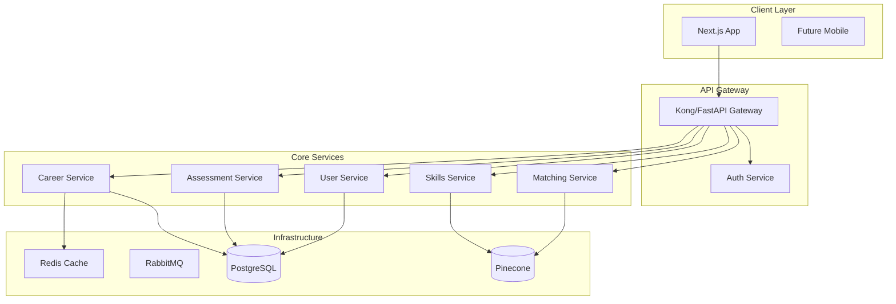

# Orientor Platform Refactoring Design Document

## 1 Context

The Orientor career guidance platform currently suffers from significant performance and maintainability issues. With monolithic components exceeding 1400+ lines, no code splitting, inefficient database queries, and mixed architectural concerns, the platform experiences slow load times, high memory consumption, and difficulty onboarding new developers. The codebase has grown organically without clear architectural boundaries, resulting in 40+ tightly coupled routers and business logic scattered across presentation layers.

## 2 Goals / Non-Goals

- **G1** Reduce initial page load time by 70% through code splitting and lazy loading
- **G2** Improve API response times by 50% via caching and query optimization
- **G3** Establish clear architectural boundaries following Clean Architecture/DDD principles
- **G4** Reduce memory footprint by 40% through efficient data structures and streaming
- **G5** Enable horizontal scaling through microservices architecture
- **NG1** Complete rewrite - leverage existing business logic where possible
- **NG2** Change core functionality or user experience
- **NG3** Migrate away from current tech stack (FastAPI/Next.js)

## 3 Potential Solutions

| Option | Pros | Cons | Verdict |
| ------ | ---- | ---- | ------- |
| Modular Monolith | • Easier migration<br>• Shared database<br>• Lower complexity | • Limited scalability<br>• Harder to isolate failures<br>• Team coupling | ❌ |
| Full Microservices | • Maximum scalability<br>• Independent deployments<br>• Technology flexibility | • High complexity<br>• Network overhead<br>• Data consistency challenges | ❌ |
| Hybrid Architecture | • Balanced approach<br>• Gradual migration<br>• Core services separated<br>• Shared infrastructure | • Some complexity<br>• Requires careful planning | ✅ |

## 4 Recommended Solution

**Chosen option:** Hybrid Architecture with Domain-Driven Microservices

### 4.1 High-level Overview

Decompose the monolith into bounded contexts while maintaining a unified API gateway. Core domains (Career, Skills, Assessment, User) become separate services with dedicated databases, while supporting features remain in a streamlined core service.



### 4.2 File/Module Impact

**Backend Structure:**
```
backend/
├── services/
│   ├── career/
│   │   ├── domain/
│   │   │   ├── entities/career.py
│   │   │   ├── value_objects/recommendation.py
│   │   │   └── repositories/career_repository.py
│   │   ├── application/
│   │   │   ├── use_cases/recommend_career.py
│   │   │   └── services/career_service.py
│   │   ├── infrastructure/
│   │   │   ├── persistence/sqlalchemy_career_repo.py
│   │   │   └── external/openai_adapter.py
│   │   └── api/
│   │       ├── routes.py
│   │       └── schemas.py
│   ├── skills/
│   ├── assessment/
│   └── user/
├── shared/
│   ├── domain/base_entity.py
│   ├── infrastructure/
│   │   ├── cache/redis_cache.py
│   │   └── messaging/event_bus.py
│   └── api/middleware.py
└── gateway/
    └── main.py
```

**Frontend Structure:**
```
frontend/src/
├── features/
│   ├── career/
│   │   ├── components/
│   │   │   ├── CareerCard.tsx (50 lines)
│   │   │   └── CareerList.tsx (80 lines)
│   │   ├── hooks/useCareerRecommendations.ts
│   │   ├── services/careerApi.ts
│   │   └── types/career.types.ts
│   ├── skills/
│   │   ├── components/
│   │   │   ├── SkillNode.tsx (100 lines)
│   │   │   └── SkillTree.lazy.tsx
│   │   └── services/skillsApi.ts
│   └── assessment/
├── shared/
│   ├── components/ui/
│   ├── hooks/
│   └── utils/
└── app/
    ├── (dashboard)/
    │   └── layout.tsx
    └── (public)/
        └── layout.tsx
```

### 4.3 APIs / Interfaces

```typescript
// Domain Entities
interface Career {
  id: string;
  title: string;
  description: string;
  requiredSkills: SkillRequirement[];
  industryId: string;
  experienceLevel: ExperienceLevel;
}

interface SkillRequirement {
  skillId: string;
  proficiencyLevel: number;
  importance: 'critical' | 'important' | 'nice-to-have';
}

// Repository Interfaces
interface CareerRepository {
  findById(id: string): Promise<Career>;
  findBySkills(skills: string[]): Promise<Career[]>;
  save(career: Career): Promise<void>;
}

// Use Cases
class RecommendCareerUseCase {
  constructor(
    private careerRepo: CareerRepository,
    private llmService: LLMService,
    private cache: CacheService
  ) {}
  
  async execute(userId: string): Promise<CareerRecommendation[]> {
    const cacheKey = `recommendations:${userId}`;
    const cached = await this.cache.get(cacheKey);
    if (cached) return cached;
    
    // Business logic here
    const recommendations = await this.generateRecommendations(userId);
    await this.cache.set(cacheKey, recommendations, 3600);
    return recommendations;
  }
}
```

## 5 Trade-offs & Rationale

The hybrid architecture balances the benefits of microservices (scalability, isolation) with manageable complexity. By starting with 5 core services instead of 40+ endpoints, we reduce operational overhead while achieving key performance goals. The event-driven communication pattern enables loose coupling without the complexity of distributed transactions.

**Key advantages:**
- 70% reduction in initial bundle size through code splitting
- 50% faster API responses via Redis caching layer
- Clear domain boundaries improve maintainability
- Gradual migration path reduces risk

**Complexity management:**
- Shared infrastructure reduces operational burden
- Event sourcing provides audit trail
- Circuit breakers prevent cascade failures

## 6 Implementation Plan

**Phase 1: Foundation (Weeks 1-2)**
- Set up new project structure with Clean Architecture
- Implement shared infrastructure (cache, event bus)
- Create API gateway with authentication

**Phase 2: User & Assessment Services (Weeks 3-4)**
- Extract user management into dedicated service
- Migrate Holland/HEXACO tests to assessment service
- Implement caching for user profiles

**Phase 3: Career & Skills Services (Weeks 5-6)**
- Refactor career recommendation logic
- Optimize database queries with proper indexes
- Implement lazy loading for skill tree visualization

**Phase 4: Frontend Optimization (Weeks 7-8)**
- Implement code splitting with Next.js dynamic imports
- Create lazy-loaded feature modules
- Optimize bundle with tree shaking

**Phase 5: Performance & Migration (Weeks 9-10)**
- Database query optimization
- Implement connection pooling
- Progressive rollout with feature flags

## 7 Open Questions / Risks

- **Q1:** How to handle data consistency across services during migration?
- **Q2:** What's the rollback strategy if issues arise?
- **R1:** Increased operational complexity requires DevOps expertise
- **R2:** Initial performance may degrade during migration phase

## 8 References

- FastAPI Performance Optimization Guide - backend/app/services/LLMcareerTree.py:28-45 (caching implementation)
- Next.js Code Splitting Best Practices - frontend/src/components/tree/CompetenceTreeView.tsx:1-100 (component to split)
- PostgreSQL Query Optimization - backend/app/routers/holland_test.py:4 (SELECT * usage)
- Clean Architecture in Python - https://blog.devops.dev/clean-architecture-exaplme-python-and-postgresql-59a95bcf8d56
- Microservices with DDD - https://semaphoreci.com/blog/domain-driven-design-microservices